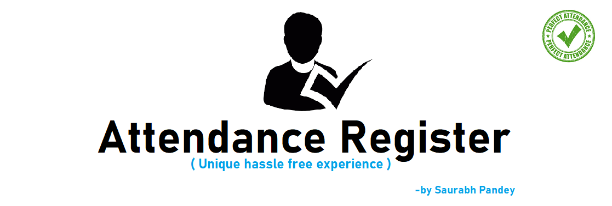

<a href="Documentation/Attendance_register.apk" target="_blank"><a>
<a href="LICENSE" target="_blank"><a>
 

### Detailed Screenshot of the Features

### Basic layout

||||
|:--:|:--:|:--:|
|**Splashscreen**|**Administrative login**|**Forgot Password**|

### Admin 

||||
|:--:|:--:|:--:|
|****|****|****|

||||
|:--:|:--:|:--:|
|****|****|****|

||||
|:--:|:--:|:--:|
|****|****|****|

||||
|:--:|:--:|:--:|
|****|****|****|

### Faculty

||||
|:--:|:--:|:--:|
|****|****|****|

||||
|:--:|:--:|:--:|
|****|****|****|

## Author 
**Thanks for going through this Repository! Have a nice day.** 
 **Saurabh Pandey** 
#### **Contact** :`saurabh17100@gmail.com`

## License
This Project is licensed under the MIT License, see the [LICENSE](LICENSE) file for details.
 
 

