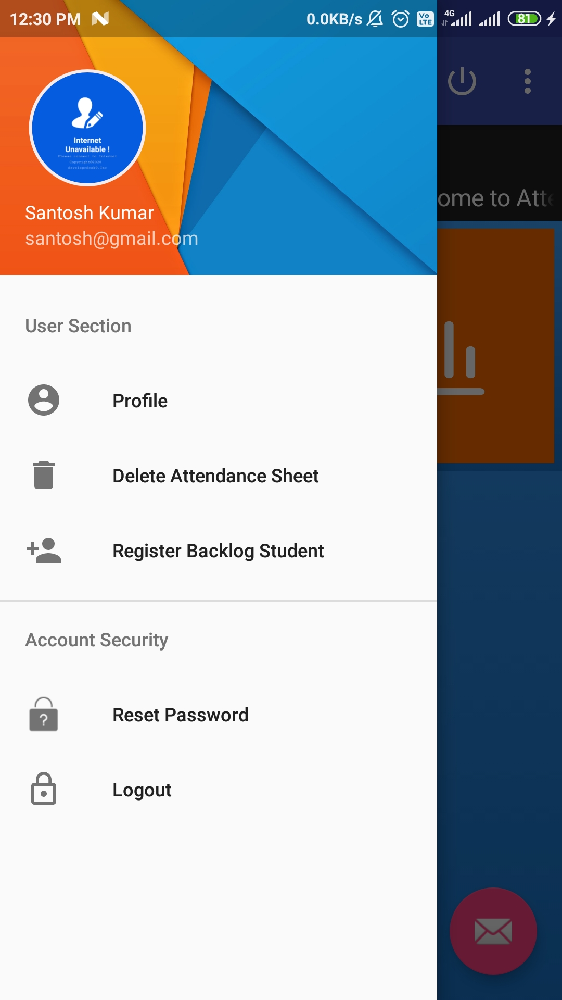

<a href="Documentation/Attendance_register.apk" target="_blank"><a>
<a href="LICENSE" target="_blank"><a>
 

## Detailed UI guide (Feature screenshoots)

### Basic layout

||||
|:--:|:--:|:--:|
|**Splashscreen**|**Administrative login**|**Forgot Password**|

|||
|:--:|:--:|
|**Internet Check**|**Forgot Password**|

### Admin 

||||
|:--:|:--:|:--:|
|**Admin Login**|**Admin dashboard**|**Navigation drawer**|

||||
|:--:|:--:|:--:|
|**Add new faculty**|**remove faculty account**|**Subject Registration to faculty**|

||||
|:--:|:--:|:--:|
|**Add new batch**|**Creating student account for new batch**|**Individual student account registration(optional)**|

||
|:--:|
|**Subject registration for extra students**|

### Faculty

||||
|:--:|:--:|:--:|
|**Faculty authentication**|**Faculty Dashboard**|**Navigation Drawer**|

||||
|:--:|:--:|:--:|
|**Attendance dashboard**|**date selection(option for convenience)**|**Attendance sheet**|

||||
|:--:|:--:|:--:|
|**Mark attendance**|**Confirmation before final submission**|**Log After final submission**|

||||
|:--:|:--:|:--:|
|**View Attendance dashboard**|**Attendance record by subject**|**Attendance record by subject & date**|

||||
|:--:|:--:|:--:|
|**by Individual date & subject**|**Edit previous attendance(as per need)**|**Updated successfully**|

## Future Possibilities and Extension of this project
- biometric can be implemented and integrate using device like **Raspberry Pi**.
- Online assignment submission.
- Resource sharing & study material.
- group discussion and doubt clearing.

## Author 
**Thanks for going through this Repository! Have a nice day.** 
 **Saurabh Pandey** 
#### **Contact** :`saurabh17100@gmail.com`

## License
This Project is licensed under the MIT License, see the [LICENSE](LICENSE) file for details.
 
 

