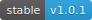
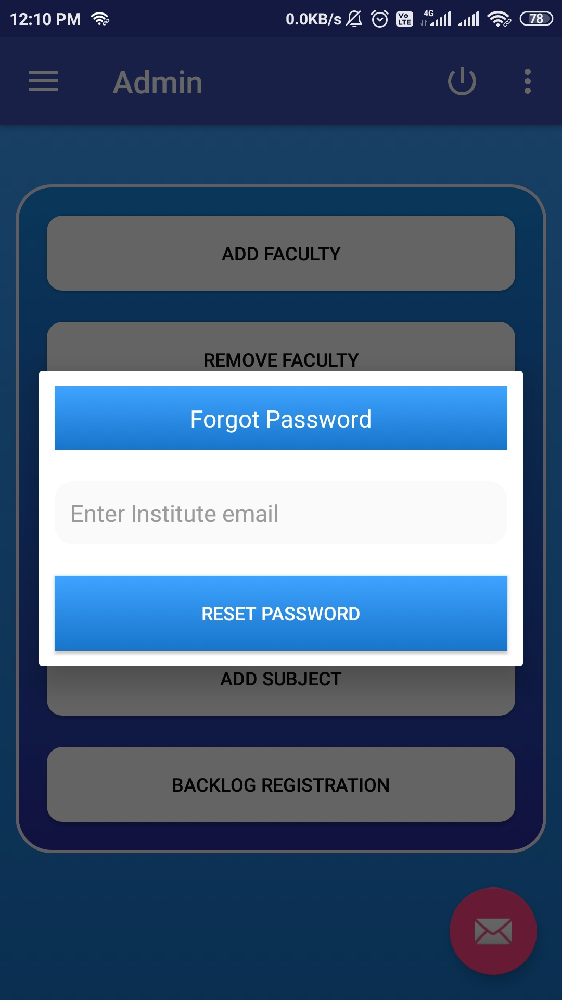
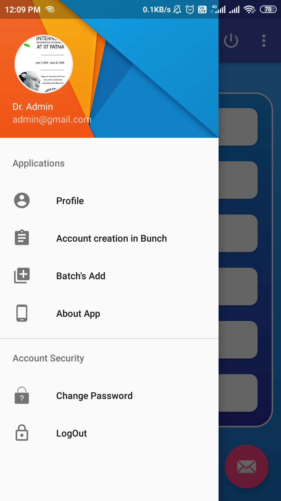

<a href="Documentation/Attendance_register.apk" target="_blank"><a>
<a href="LICENSE" target="_blank"><a>
 

## About (Admin and Faculty Version)
Attendance Register is an android based Attendance management solution.

## Features
-
-

## Functionalities
- **Admin**
    - ..
    - ..

- **Faculty**
    - ..
    - ..

## Security 
- Email verification.
- Login details and device id verification to avoid fraud and Spamming.
- device block if unusual activity detected.
- Allows single device login per id at time.

# Screenshots #

Here are the few screenshots, for detailed UI guide [Click here](FEATURE_SCREENSHOT.md)

### Basic layout

||||
|:--:|:--:|:--:|
|**Splashscreen**|**Administrative login**|**Forgot Password**|

||
|:--:|
|**Internet Check**|

### Admin Section

Here are the few screenshots, for detailed UI guide [Click here](FEATURE_SCREENSHOT.md)

||||
|:--:|:--:|:--:|
|**Admin Authentication**|**Admin dashboard**|**Naviagtion drawer**|

### Faculty Section
 Here are the few screenshots, for detailed UI guide [Click here](FEATURE_SCREENSHOT.md)

||||
|:--:|:--:|:--:|
|**Faculty authentication**|**Faculty Dashboard**|**Navigation Drawer**|

## Note :
Above I have Included only few screenshots , for detailed UI guide [Please Click here](FEATURE_SCREENSHOT.md)

## Tools Used
* [Android Studio](https://developer.android.com/studio) : Used as the Android developement environment.
* [Firebase Realtime Database](https://firebase.google.com/products/realtime-database) : Used as the backend database.
* [Firebase Storage](https://firebase.google.com/products/storage) : Use to store product Image
* [Firebase Authentication](https://firebase.google.com/products/auth) : Used to manage User information

## Contributing
You are welcome to contribute :

1. [Fork it](https://github.com/saurabhpandey9/Attendance-Management-App-Admin-Faculty-version-I/fork) :`https://github.com/saurabhpandey9/Attendance-Management-App-Admin-Faculty-version-I/fork`
2. Create new branch : `git checkout -b new_feature`
3. Commit your changes : `git commit -am 'Added new_feature'`
4. Push to the branch : `git push origin new_feature`
5. Submit a pull request !

## Author 
**Thanks for going through this Repository! Have a nice day.** 
 **Saurabh Pandey** 
#### **Contact** :`saurabh17100@gmail.com`

## License
This Project is licensed under the MIT License, see the [LICENSE](LICENSE) file for details.
 
 

